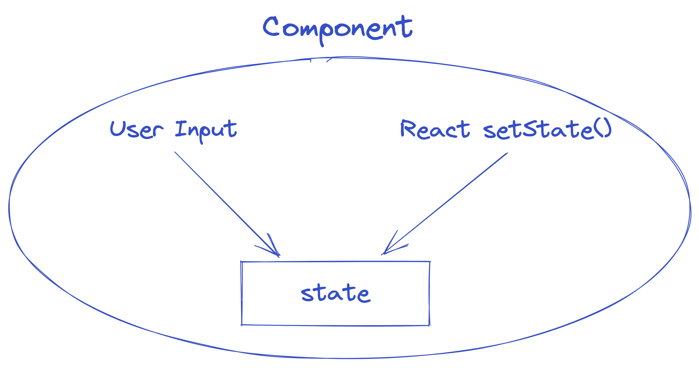

# Forms

HTML 表单（Form）与其他的 React DOM Elements 不太一样。它本身就是 stateful 的。

当表单被提交时，它的默认行为是跳转到一个新页面。但更常见的行为是，写一个 js 函数来处理表单提交的数据。

`<input>`、`<textarea>` 和 `<select>`等元素通常有两种方法修改他们的 state。这类 component 被称为**Controlled Components**

1. 用户输入
2. 使用 React 自带的`setState()`方法



# Controlled Component

## INPUT

以下表单中的名字是是用户输入的`<input>`，用户输入之后`handleChange`方法更新了 state 中`name`的值，然后该`<input>`再去显示 state 中`name`的值

```js
import { useState } from "react";

function NameForm() {
  const [name, setName] = useState("");

  function handleChange(event) {
    this.setName(event.target.value);
  }

  function handleSubmit(event) {
    alert("A name was submitted: " + this.state.value);
    event.preventDefault();
  }

  return (
    <form onSubmit={handleSubmit}>
      <label>
        Name:
        <input type="text" value={name} onChange={handleChange} />
      </label>

      <input type="submit" value="Submit" />
    </form>
  );
}

export default NameForm;
```

### INPUT: file

`<input>`也可以用来上传文件。因为这类 input 只能是用户上传的，并没有 React 的方法可以生成文件，所以这种情况下是**uncontrolled component**.

```html
<input type="file" />
```

### INPUT: multiple

当有多个 input 时，可以用属性`name`来标记。

- `event.target.name`：input 的 name
- `event.target.type`：input 的 type
- `event.target.type`：input 的 value

```html
<input name="name" type="text" />
<input name="sex" type="checkbox" />
<input name="age" type="number" />
```

## TEXTAREA

`<textarea>`用法与`<input>`一致。也用`value`属性来储存`<textarea>`的值。

## SELECT

`<select>`用`value`属性来储存某人选项的值。

```js
<select value={this.state.value} onChange={this.handleChange}>
  <option value="grapefruit">Grapefruit</option>
  <option value="lime">Lime</option>
  <option value="coconut">Coconut</option>
  <option value="mango">Mango</option>
</select>
```


# Uncontrolled Component
**Controlled Components**的缺点：
- 当你为一个**Controlled Components**定义了默认值（`value="null"`），但输入仍然是可编辑的，你可能不小心将值设置为 undefined 或 null。--> 这会导致🐞。
- 你需要为每一种修改数据的可能性写一个event handler

**Uncontrolled Component**是一个解决方法。🥸🥸🥸
**Controlled Components**的数据由React component来处理，而**Uncontrolled Component**的数据由本身DOM处理。

在**Uncontrolled Component**中，我们用[`ref`](../3.advanced_guides/15.Refs%20and%20the%20DOM.md)代替`Event Handler`